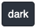
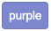
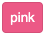
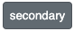
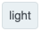
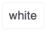
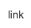
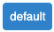

# btn
Button component for vue

## Usage

### Install with npm:
```
npm install https://github.com/goudev/btn.git --save
```

### Install with yarn:
```
yarn add https://github.com/goudev/btn.git
```

### How to use:
```javascript
<script>
import btn from 'btn'

export default {
  components: {
    btn
  }
}
</script>
```
```html
<template>
  <btn>My Button</btn>
</template>
```

### Complete color reference:
| Code  | Example |
| ------------- | ------------- |
| `<btn class="primary">primary</btn>`  |   |
| `<btn class="success">success</btn>`  |   |
| `<btn class="info">info</btn>`  |   |
| `<btn class="warning">warning</btn>`  |   |
| `<btn class="danger">danger</btn>`  |   |
| `<btn class="dark">dark</btn>`  |   |
| `<btn class="purple">purple</btn>`  |   |
| `<btn class="pink">pink</btn>`  |   |
| `<btn class="secondary">secondary</btn>`  |   |
| `<btn class="light">light</btn>`  |   |
| `<btn class="white">white</btn>`  |   |
| `<btn class="link">link</btn>`  |   |
### Complete size reference:
| Code  | Example |
| ------------- | ------------- |
| `<btn class="primary small">small</btn>`  |   |
| `<btn class="primary">default</btn>`  |   |
| `<btn class="primary large">large</btn>`  |   |